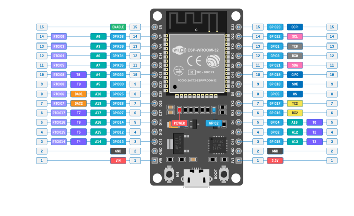
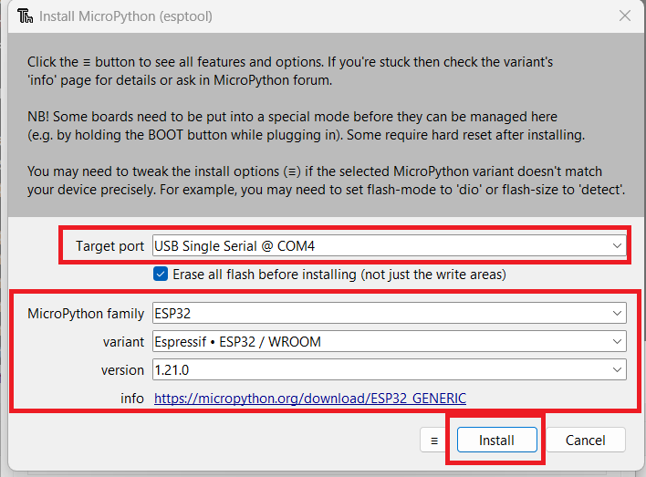

If you want to program your ESP32 and ESP8266 with MicroPython firmware,
it’s very handy to use an IDE. In this guide, we’ll introduce you to Thonny IDE

# ESP32 DEVKIT V1 - Board

# MicroPython
MicroPython is a Python 3 programming language re-implementation targeted for microcontrollers and embedded systems.
MicroPython is very similar to regular Python. Apart from a few exceptions, the language features of Python are also available in MicroPython. 
The most significant difference between Python and MicroPython is that MicroPython was designed to work under constrained conditions.

# Installing Thonny IDE

Go to https://thonny.org - 	Download version 4.1.3 , I insalled on Windows 11

After the installation is completed, open Thonny IDE

# Flashing MicroPython Software using Thonny IDE

1) MicroPython isn’t flashed onto the ESP32 or ESP8266 boards by default. 
The first thing you need to do to start programming your boards with MicroPython is flash/upload/burn the firmware.

2) Connect your ESP32 or ESP8266 board to your computer.

3) Open Thonny IDE. Go to Tools > Options > Interpreter.

4) Select the interpreter you want to use accordingly to the board you’re using and select the COM port your board is connected to. Finally, click on the link Install or update firmware.

5) Select the port once again, and then click Family , Varient , Version and finally click on Install.

6) Thonny IDE should now be connected to your board and you should see the prompt on the Shell.

   MicroPython v1.21.0 on 2023-10-05; Generic ESP32 module with ESP32

  Type "help()" for more information.

   >>> 
